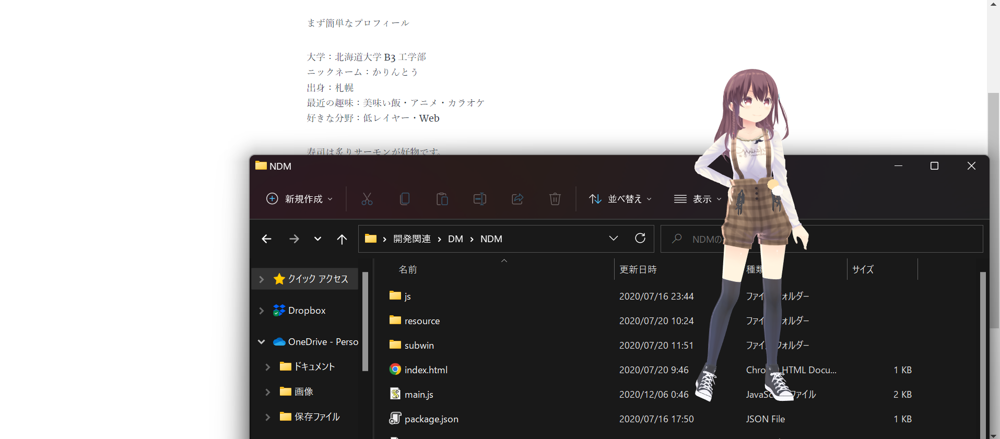

唐突ですが自己紹介をします。

まず簡単なプロフィール

大学：北海道大学 B3 工学部 
ニックネーム：かりんとう 
出身：札幌 
最近の趣味：美味い飯・アニメ・カラオケ 
好きな分野：低レイヤー・Web 

寿司は炙りサーモンが好物です。 
セキュリティキャンプ 2022 では L3 ゼミで黙々と C コンパイラーを書いていました。 
成果物：https://github.com/karintou8710/kcc/tree/develop 
競プロ, CTF, ハッカソン, ISUCON...など興味を持ったイベントなどに参加しています。 
プログラミングは高校 2 年あたりから始めました。 
Web 関連から入門して、デスクトップマスコットとかを作って遊んでいました。 
可愛いは正義。  

 

## これまで開発したもの

**iNAZO** 
大学の成績をグラフで直感的にグラフで見れる Web アプリ 
OGP 画像を動的にグラフ画像生成するのに苦労した(しかし、ほぼ使われていない) 
https://github.com/karintou8710/iNAZO 

**mathNET** 
数学 Q&A サイト。既にサービス終了。。 

**kcc** 
セキュリティキャンプで開発した C コンパイラ。 
セルフホストを達成。

他にも LINE BOT, DISCORD BOT ... etc を開発した経験あり。 
TCP/IP 自作インターンに参加したりしていたこともあった。 

## 近況

技育展にチームで出ることになったので、そっちの開発をやっています。 
久々のアプリ開発で楽しいです。 

## LINK

github: https://github.com/karintou8710?tab=repositories 
Qiita: https://qiita.com/karintou8710 
